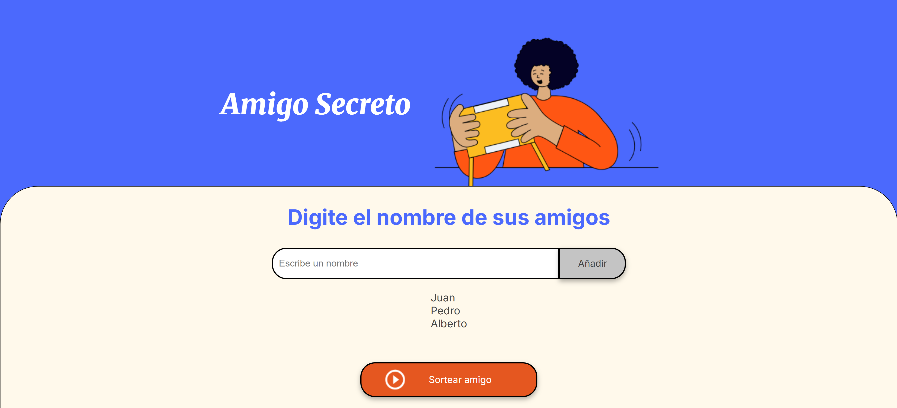

# Challenge-Amigo-Secreto

<em> # ¿Cómo se juega? </em>

Para poder comenzar a jugar, se deben seguir los siguientes pasos:

1. Cada jugador debe escribir su nombre en el recuadro donde se indica "Escribe un nombre"

2. Añadir el nombre escrito hasta completar la lista de jugadores

3. ¡Listo es hora de sortear el amigo secreto! Para esto se debe hacer clic en el botón "Sortear Amigo"

4. El amigo secreto será mostrado en la pantalla

